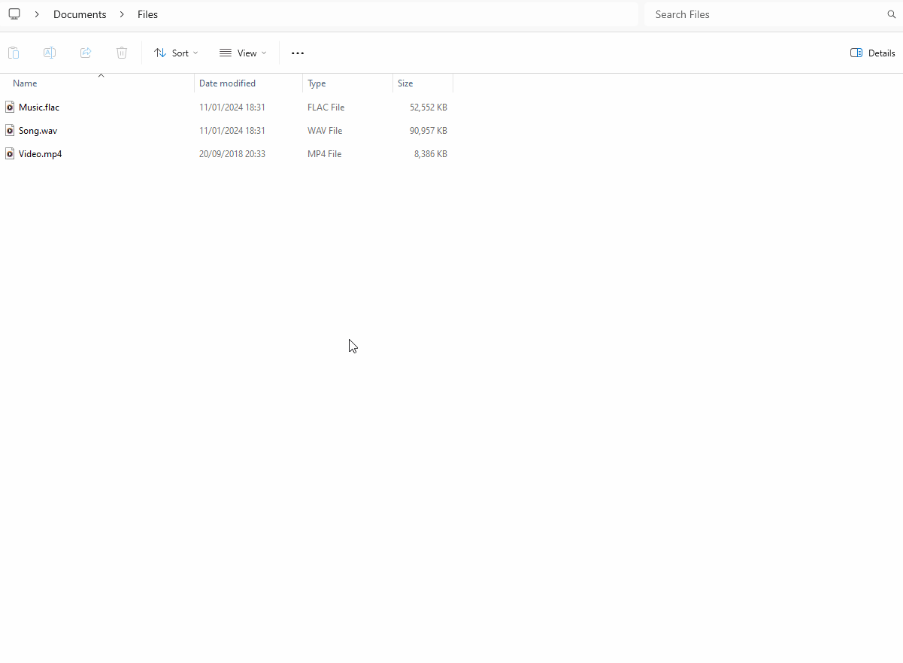

# File Converter

## Description

**File Converter** is a very simple tool which allows you to convert and compress one or several file(s) using the context menu of windows explorer.

You can download it here: [file-converter.io](https://file-converter.io/?from=readme.md).

You can find more information about what's in File converter and how to use it on the [wiki](https://github.com/Tichau/FileConverter/wiki).

## Donate

File Converter is a personal open source project started in 2014. I have put hundreds of hours adding, refining and tuning File Converter with the goal of making the conversion and compression of files an easy task for everyone.

You can help me by [contributing to the project](https://github.com/Tichau/FileConverter/wiki#contribute), by [making a donation](https://www.paypal.com/donate/?cmd=_donations&business=3BDWQTYTTA3D8&item_name=File+Converter+Donations&currency_code=EUR&Z3JncnB0=) or just by [saying thanks​](https://saythanks.io/to/Tichau) :).

## Troubleshooting

If you encounter any problem with File Converter, you can:

* See the already known problems in the [troubleshooting section of the documentation](https://github.com/Tichau/FileConverter/wiki/Troubleshooting).
* Or report an issue on the [bug tracker](https://github.com/Tichau/FileConverter/issues).

## Setup development environment

### Requirements

For File Converter and its explorer extension:

* Visual Studio 2022

For the installer:

* [Wix 4](http://wixtoolset.org/)
  * [Community Visual Studio Extension](https://marketplace.visualstudio.com/items?itemName=FireGiant.FireGiantHeatWaveDev17)
* [Windows SDK Signing Tools for Desktop Apps](https://developer.microsoft.com/fr-fr/windows/downloads/windows-10-sdk)

## Thanks

Thanks to all the contributors of File Converter project.

### Localization

* Thanks to **Khidreal** and **hugok79** for the Portuguese localization.
* Thanks to **Marhc** for the Brazilian localization.
* Thanks to **Chachak** for the Spanish localization.
* Thanks to **Davide** for the Italian localization.
* Thanks to **nikotschierske** for the German localization.
* Thanks to **Snoopy1866** for the Simplified Chinese localization.
* Thanks to **MayaC0re** for the Turkish localization.
* Thanks to **vishveshjain** for the Hindi localization.
* Thanks to **Mahmoud0Sultan** for the Arabic localization.
* Thanks to **Sedimentary-Rock** for the Traditional Chinese localization.
* Thanks to **CrisBalGreece** for the Greek localization.
* Thanks to **AshiVered** for the Hebrew localization.
* Thanks to **MrHero118** for the Persian localization.

## Middlewares

File converter uses the following middlewares:

**ffmpeg** (v6.1.1) as file conversion software.
Thanks to ffmpeg devs for this awesome open source file conversion tool. [Web site link](https://ffmpeg.org)

**ImageMagick** (v13.5) as image edition and conversion software.
Thanks to image magick devs for this awesome open source image edition software suite.  [Web site link](http://imagemagick.net)
And thanks to dlemstra for the C# wrapper of this software. [Github link](https://github.com/ImageMagick/ImageMagick)

**Ghostscript** (10.02.1) as pdf edition software.
Thanks to ghostscript devs. [Download link](https://www.ghostscript.com/download/gsdnld.html)

**SharpShell** to easily create windows context menu extensions.
Thanks to Dave Kerr for his work on SharpShell. [GitHub link](https://github.com/dwmkerr/sharpshell)

**Ripper** and **yeti.mmedia** for CD Audio extraction.
Thanks to Idael Cardoso for his work on CD Audio ripper. [Code project link](https://www.codeproject.com/Articles/5458/C-Sharp-Ripper)

**Markdown.XAML** for markdown rendering in the wpf application.
Thanks to Bevan Arps for his work on Markdown.XAML. [GitHub link](https://github.com/theunrepentantgeek/Markdown.XAML)

**WpfAnimatedGif** for animated gif rendering in the wpf application.
Thanks to Thomas Levesque for his work on WpfAnimatedGif. [GitHub link](https://github.com/XamlAnimatedGif/WpfAnimatedGif)

## License

File Converter is licensed under the GPL version 3 License.
For more information check the LICENSE.md file in your installation folder or the [gnu website](https://www.gnu.org/licenses/gpl.html).

