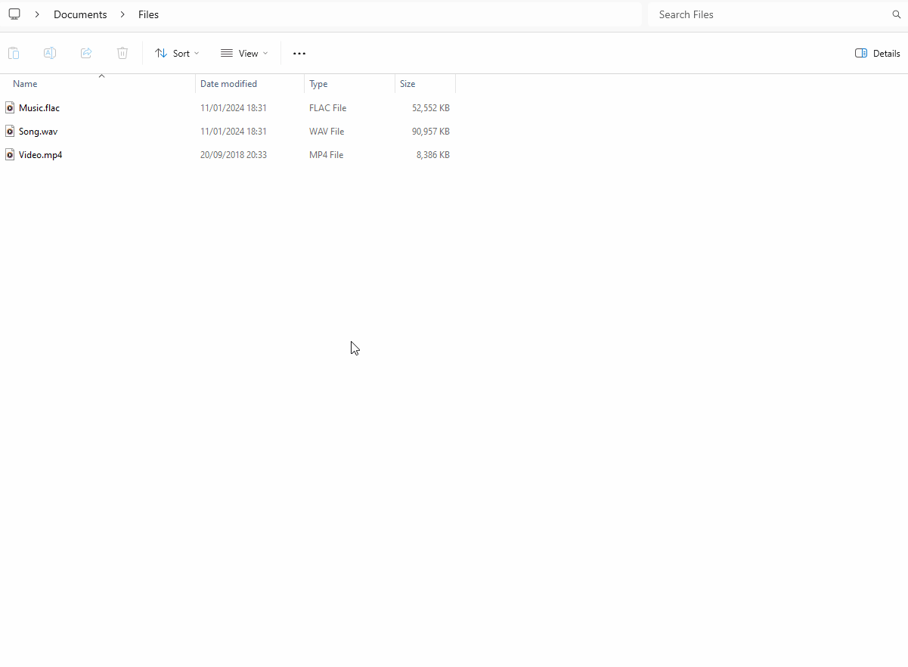

# ZFileConverter

ZFileConverter is a maintained Windows Explorer-first file conversion utility.
It keeps the original File Converter idea intact: select files, right-click, choose a preset,
and get useful outputs without opening a heavy editor.

This fork focuses on making the app feel alive again: smarter presets, safer conversions,
clearer diagnostics, repair tools, and a reproducible release path.



## What Is Improved

- Smart output templates for preset names, preset folders, source dates, and formatted counters.
- AVIF output visibility in preset settings.
- A Settings > Health tab for FFmpeg, ImageMagick, Ghostscript, Office, settings, and Explorer integration.
- A one-click Explorer menu repair launcher from Settings.
- Queue actions for opening completed outputs and retrying failed conversions.
- Diagnostics actions for copying logs and opening the log folder.
- Safer cleanup for FFmpeg, Office, CDA, GIF, ICO, PDF/image, and Explorer temp-file flows.
- Windows CI that builds with MSBuild and uploads validation artifacts.

## Core Workflow

1. Install ZFileConverter.
2. Right-click one or more files in Windows Explorer.
3. Choose a conversion preset.
4. Use Settings to customize presets, output folders, file name templates, and health/repair checks.

## Smart Template Examples

Output filename templates now support tokens such as:

- `(preset)` or `(presetname)` for the selected preset name.
- `(presetpath)` for the preset folder path.
- `(sc:yyyy-MM-dd)` for source creation date.
- `(sm:yyyy-MM-dd)` for source modified date.
- `(n:i:D3)` and `(n:c:D3)` for formatted page/frame counters.

Example:

```text
(p:documents)ZFileConverter\(presetpath)\(sm:yyyy-MM)\(f) - (preset)
```

## Build

See [docs/BUILDING.md](docs/BUILDING.md) for the local and CI build path.

Short version:

```powershell
.\build.ps1 -Configuration Release -Platform x64
```

## Install

See [docs/INSTALLING.md](docs/INSTALLING.md).

Recommended path: download the newest `ZFileConverter-*-x64-setup.msi` from
[GitHub Releases](https://github.com/ZaidNAlAsali/FileConverter/releases), run it,
then open Settings > Health if the Explorer menu does not appear.

## Release

Use [RELEASE_CHECKLIST.md](RELEASE_CHECKLIST.md) before publishing a build.
The checklist covers clean checkout, dependency restore, smoke conversions, installer verification,
Explorer integration, diagnostics, version metadata, and GitHub release artifacts.

## Troubleshooting

Open Settings > Health first. It checks the common failure points:

- Missing FFmpeg, ImageMagick, or Ghostscript files.
- Missing Microsoft Office support for document conversions.
- Broken Explorer shell registration.
- Missing default or user settings files.

If the right-click menu is missing, use Settings > Health > Repair Explorer Menu.
If a conversion fails, open Diagnostics, copy logs, and include them in an issue.

## Development Requirements

- Windows 10 or newer.
- Visual Studio 2022 with .NET Framework 4.8 targeting tools.
- MSBuild on PATH, or Visual Studio Developer PowerShell.
- WiX 5 for installer builds. The WiX SDK packages restore through NuGet.
- Windows SDK signing tools only when producing signed release installers.

## Credits

ZFileConverter is a maintained fork of Adrien Allard's File Converter project.
The original project, contributors, translators, and middleware authors made the core app possible.

Middleware used by the app includes FFmpeg, ImageMagick, Ghostscript, SharpShell, Ripper,
yeti.mmedia, Markdown.Xaml, and WpfAnimatedGif.

## License

ZFileConverter is licensed under the GPL version 3.
See [LICENSE.md](LICENSE.md).
