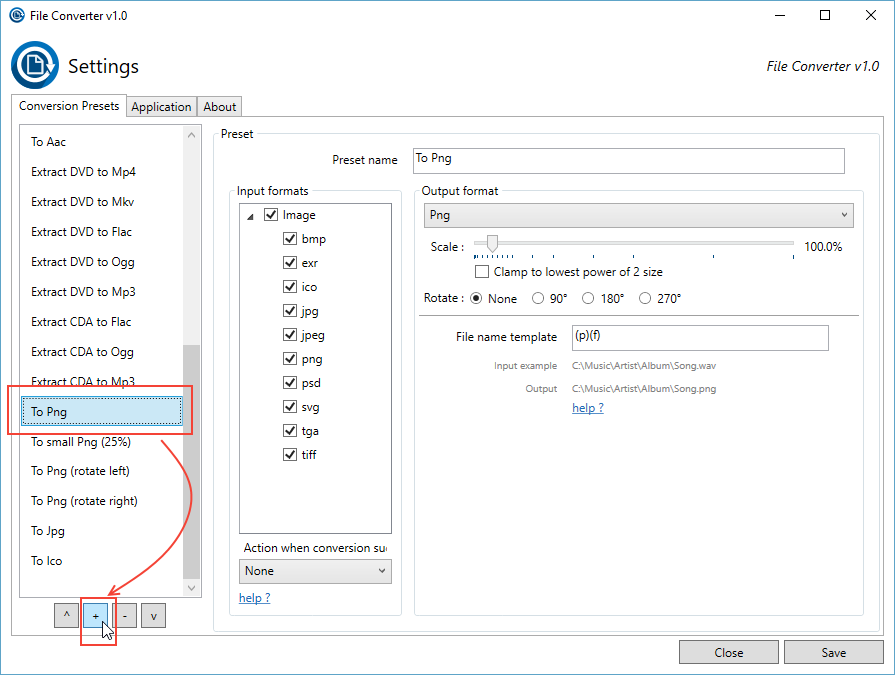
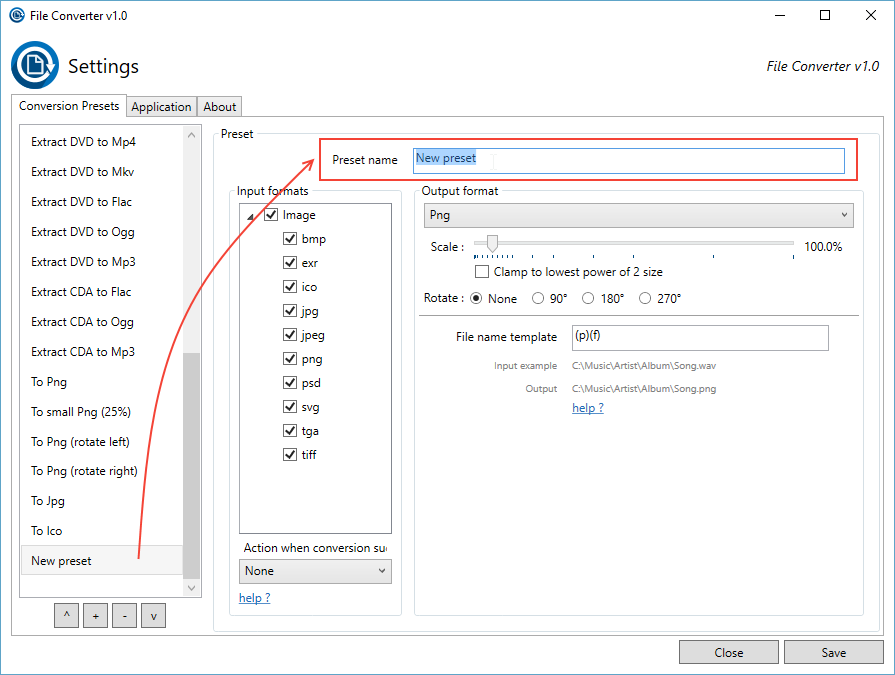
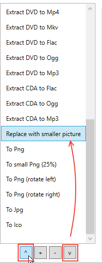
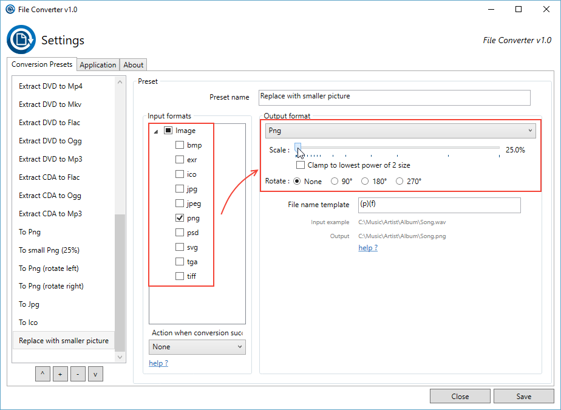
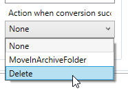
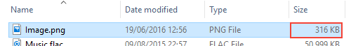

# How to create a new custom preset?

Let's say you like to take photos with your camera and then, you want to send it to your friends via email.
You need to send 3 or 4 emails because each photo file is quite heavy, but your friends don't care about having an awesome super high definition photography ... 
So it's quite useless and boring to make multiple emails.

# Create a custom preset

Let's create a simple preset that will resize your photo files in two clicks.

1. Open the file converter settings using the shortcut in the windows start menu (or via the context menu).

2. (Optional) You can select a preset that looks like the one you want to create. When you'll click on add preset, it will duplicate the currently selected preset. 

3. Clic on the add preset button (the '+' button below the preset list) to create a new preset.
 
 

4. Your preset is now created and added to the bottom of the list. You can now give a name to your preset.
 
 

5. You can adjust the position of your preset in the context menu by change its position in the preset list with the two arrows buttons ('v' and '^').

 

5. You can define on with file type your preset will appear (in the context menu) by checking (or unchecking) the file extensions in the "input formats" section (left side).

6. And you can define the settings of your preset (how it will be converted) in the "Output format" section (right side).

 

7. Here we want to convert only the png image file to the same file type while reducing the size of the image to 25% (in order to have a lighter file).

8. You can specify what File Converter will do with the input file when the conversion succeeds bellow the "Input format list". In our case, we want to delete the input file and only keep the reduced version.

 

9. Save your new preset by clicking on the save button (bottom right of the window).

## Enjoy!

You have now access to your custom preset in the file converter menu on all png files.

 

And you can easily resize your photos using only two clicks :)

 
